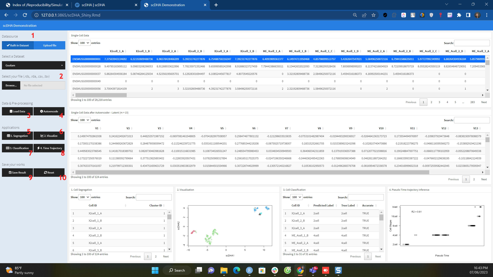

# Overview

Based on the proposed scDHA framework, this is a simple Shiny application that will give an illustration about how the scDHA framework works.

 
 

# GitHub

The full source code is located in GitHub at this URL:
https://github.com/tctruc79/scDHA_Shiny.git
          
 
 

# How it works

## 1. Select Datasource

You are able to select the datasources from built-in datasets in the scDHA packages, or you can choose to upload your dataset files. 

The extentions supported are: .rds, .rda, .csv, .tsv.

For example:

.rds: Goolam.rds, files in download data.
.rda: Goolam.rda, files in download data.
.csv: goolam_imputed.csv, files in imputed folder
.tsv: goolam_imputed.csv, converted from imputed.csv files, using csv_to_tsv function in *run_scDHA.R* file in this project.

 

## 2. Select Dataset

### 2.1. Built-in datasets:

You will want to select a dataset from application's listed down all scDHA's built-in datasets, i.e. "Goolam".

 

### 2.2. Upload files:

You will also be able to select "Upload Dataset Files" and browse to the file located in your local machine.

 

## 3. Load Data

Next, press **"Load Data"** button to load data from above selected datasource. The data will be loaded to the table on the top area of the screen, "Single-Cell Data".

 

## 4. scDHA Autoencode

The data before doing analysis, it should be normalized, dimension reduced, denoised by pre-process through a scHDA pipeline. Press button **"Autoencode"** to do this.

 

## 5. Segregation

After normalized the data, we do cell segregation, press button **"1. Segregation"** to perform this.

The result will be shown in the first portion on the bottom area "1. Cell Segregation", this will list cells by ID and the Cluster ID that the cell is belong to.

 

## 6. Visualization

To visualize the segregation result, press button **"2. Visualization"**, a second portion on the bottom will show the plot that illustrates how the groups of cell types are well separated to each other.

 

## 7. Classification, 

Next application of scDHA framework is the capability to classify the cells with high accuracy and low variance. Press button **"3. Classification"** to see the result shown in the third portion of the bottom area.

This table will list cells with their IDs, the predicted label, compared to its true label and also the accuracy ratio.

 

## 8. Time Trajectory

The last application of scDHA shown in this Shiny app is the pseudo-time trajectory of the cell developmental stages. This can be obtained by pressing on button **"4. Time Trajectory"**.

 

## 9. Save results

After running the analysis, you are able to save the result, press **"Save Result"** button to get this.

 

## 10. Reset

To do analysis with new data, you should reset all the variables, configuration to the default values. **"Reset"** button will have you to do that.

