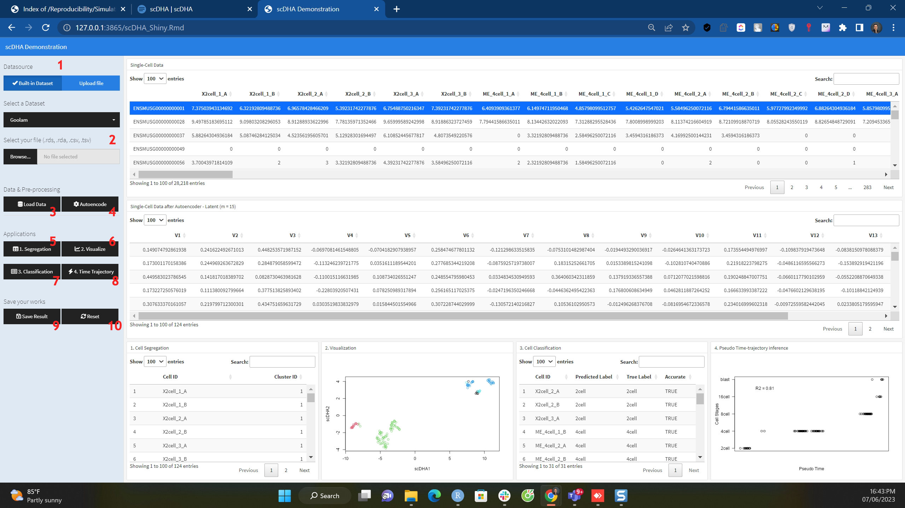
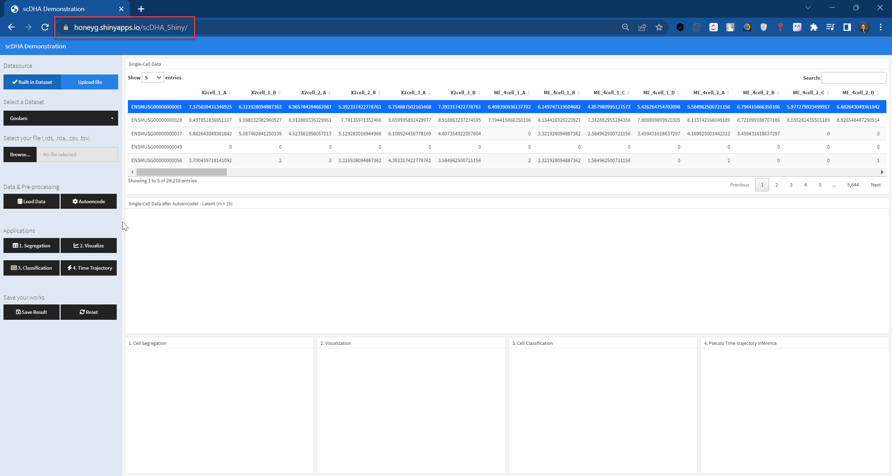
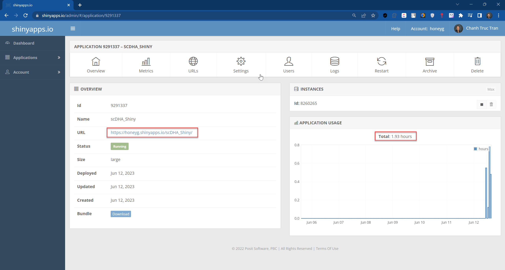
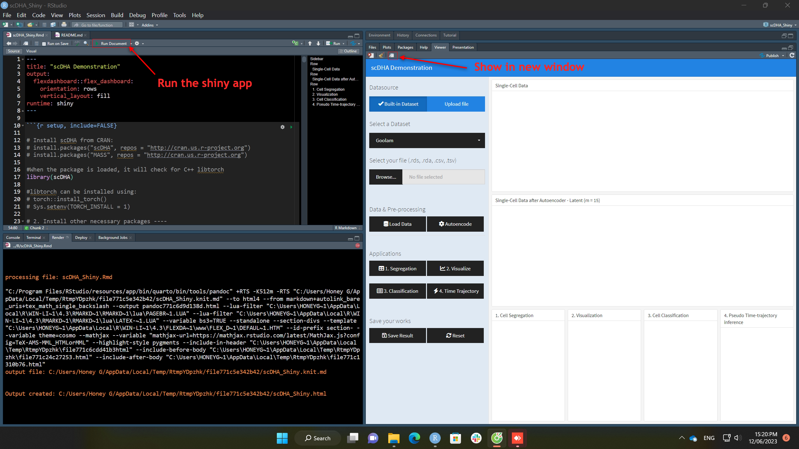
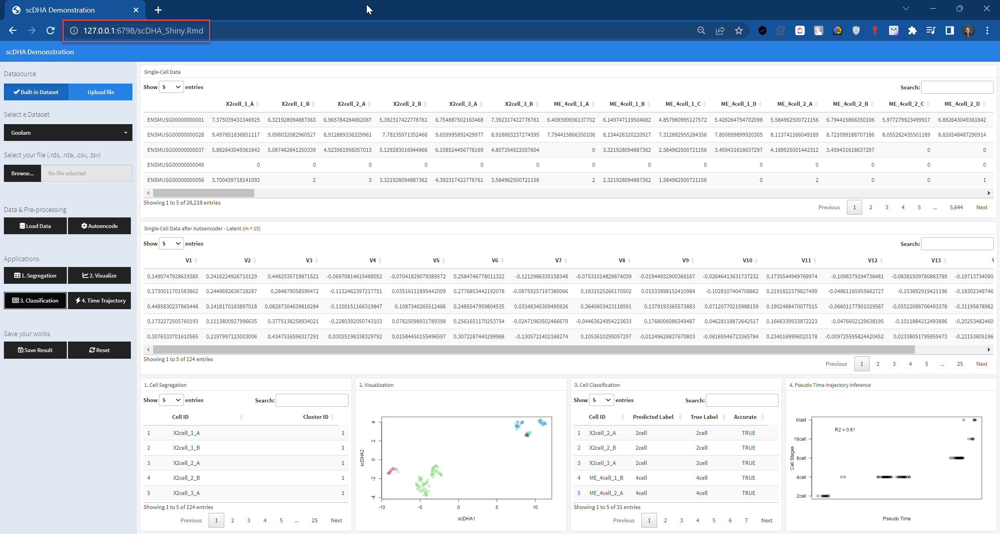

# Overview

Based on the proposed scDHA framework, this is a simple Shiny application that will give an illustration about how the scDHA framework works.

 
 

# GitHub

The full source code is located in GitHub at this URL:
https://github.com/tctruc79/scDHA_Shiny.git
          
 
 

# How to setup

## For End-Users

The application has been deployed to this URL

https://honeyg.shinyapps.io/scDHA_Shiny/

This is a free shinyapp website to deploy the app with maximum **5 applications** and **25 active hours** per month for Free subscription plan.

End-users may want to know how to run the app by reading the session "**How it works**".

 

This is *Administrator* page of `shinyapps.io`

 

However, this free instance only allows **1.0 Gb of RAM**, so the calculation of our smallest dataset file Goolam is crashed shortly with `oom (out of memory)` error at the very first step of the process - **Autoencoder**. For this such complicated algorithm and framework, to publish the app to Production, it should purchase higher subscription plan. 

 
 

## For Developers

### Important notes

This demonstration shiny app has been tested on some OS such as Windows 11, MacOS (intel), and Ubuntu (22.04.2 LTS) and it run well. 

However, for MacOS (M1/M2), it cannot install `torch` library, as this has not been supported yet. 

 

### Install R and RStudio
https://posit.co/download/rstudio-desktop/

 

### Install RTools
https://cran.r-project.org/bin/windows/Rtools/

 

### Running with RStudio
#### Clone the repository from GitHub
https://github.com/tctruc79/scDHA_Shiny.git

 

#### Install required packages

All required packages and dependencies to install are put in file *install_packages.R* in **R** folder.

We just need to install the packages as followings:

`# 1. Install "scDHA" and other packages from CRAN:`

`pkgs <- c(`  
    `"scDHA",`     
    `"MASS",`      
    `"torch",`  
    `"mclust",`     
    `"BiocManager",`
     
    `"flexdashboard",`  
    `"shiny",`  
    `"shinyWidgets",`  
    `"shinyjs",`  
     
    `# install.packages("DT")`  
    `"DT",`
     
    `# Core`  
    `"tidyverse"`  
`)`

 

`install.packages(pkgs)`

# 2. Install other necessary packages

`BiocManager::install("SingleCellExperiment")`

`#libtorch can be installed using:`
`# torch::install_torch(reinstall = TRUE)`

 

#### Loading libraries

`# Main framework`

`library(scDHA)`

 

`# Shiny`

`library(flexdashboard)`

`library(shiny)`

`library(shinyWidgets)`

`library(shinyjs)`

`library(DT)`

 

`# Core`

`library(tidyverse)`

 

#### Functions that needs to perform analysis using scDHA library

Functions perform scDHA analysis are in the file *run_scDHA.R* in **R** folder.

`# Functions that perform the scDHA framework`

`source("run_scDHA.R")`

 

#### Run the Shiny app with RStudio

- Open the `scDHA_Shiny.Rmd` RMarkdown file in **R** folder of the project.

- Click on **'Run Document'** button.

 

- In the Viewer tabpage on the right, click on **'Show in new window'** to view it in bigger browser window.

 
 
 

# How it works

## 1. Select Datasource

You are able to select the datasources from built-in datasets in the scDHA packages, or you can choose to upload your dataset files. 

The extentions supported are: .rds, .rda, .csv, .tsv.

For example:

- `.rds:` *Goolam.rds*, files in download data.

- `.rda:` *Goolam.rda*, files in download data.

- `.csv:` *goolam_imputed.csv*, files in imputed folder

- `.tsv:` *goolam_imputed.csv*, converted from imputed.csv files, using csv_to_tsv function in *run_scDHA.R* file in this project.

All of sample data with above extensions are located in `/data` folder of the project.

 

## 2. Select Dataset

### 2.1. Built-in datasets:

You will want to select a dataset from application's listed down all scDHA's built-in datasets, i.e. "Goolam".

 

### 2.2. Upload files:

You will also be able to select "Upload Dataset Files" and browse to the file located in your local machine.

 

## 3. Load Data

Next, press **"Load Data"** button to load data from above selected datasource. The data will be loaded to the table on the top area of the screen, "Single-Cell Data".

This step is quite fast to load data, about 1 - 2 minutes, however, when testing or doing demonstration please select small dataset to perform depending on your computer's specification.

 

## 4. scDHA Autoencode

The data before doing analysis, it should be normalized, dimension reduced, denoised by pre-process through a scHDA pipeline. Press button **"Autoencode"** to do this.

This step is very time consuming, so please be patient waiting for the task running to complete. **DO NOT press the button many times**. 

For example, performing classsification on `Goolam` dataset took about 4-5 minutes.

 

## 5. Segregation

After normalized the data, we do cell segregation, press button **"1. Segregation"** to perform this.

The result will be shown in the first portion on the bottom area "1. Cell Segregation", this will list cells by ID and the Cluster ID that the cell is belong to.

After data has been normalized using scDHA Autoencoder in Part 4. This step performs quite fast.

 

## 6. Visualization

To visualize the segregation result, press button **"2. Visualization"**, a second portion on the bottom will show the plot that illustrates how the groups of cell types are well separated to each other.

After data has been normalized using scDHA Autoencoder in Part 4. This step performs quite fast.

 

## 7. Classification, 

Next application of scDHA framework is the capability to classify the cells with high accuracy and low variance. Press button **"3. Classification"** to see the result shown in the third portion of the bottom area.

This table will list cells with their IDs, the predicted label, compared to its true label and also the accuracy ratio.

This step is also time consuming, so please be patient for it to finish. For example, performing classsification on `Goolam` dataset took about 4-5 minutes.

 

## 8. Time Trajectory

The last application of scDHA shown in this Shiny app is the pseudo-time trajectory of the cell developmental stages. This can be obtained by pressing on button **"4. Time Trajectory"**.

After data has been normalized using scDHA Autoencoder in Part 4. This step performs quite fast.

 

## 9. Save results

After running the analysis, you are able to save the result, press **"Save Result"** button to get this.

 

## 10. Reset

To do analysis with new data, you should reset all the variables, configuration to the default values. **"Reset"** button will have you to do that.

